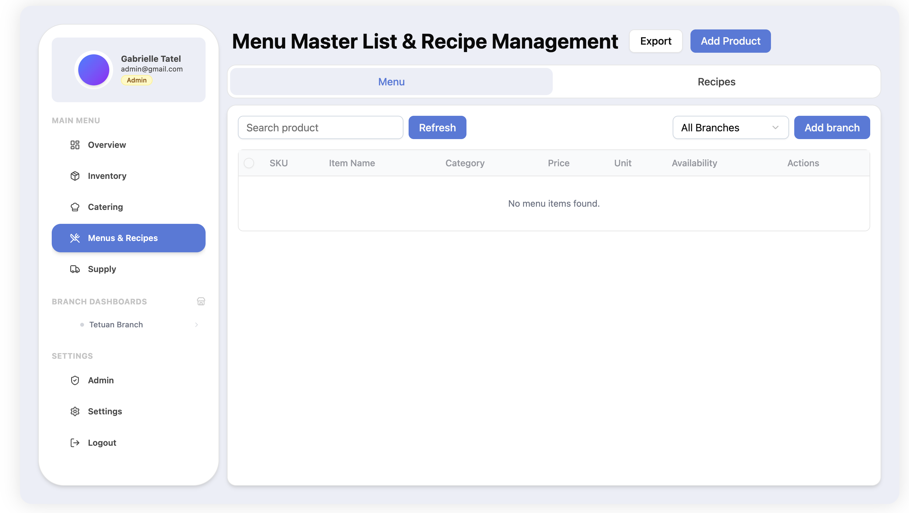
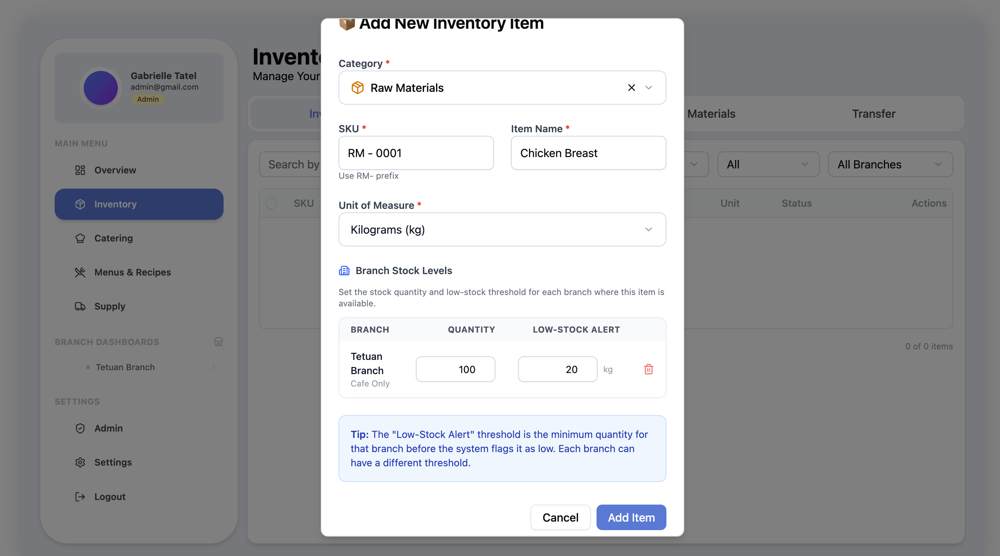
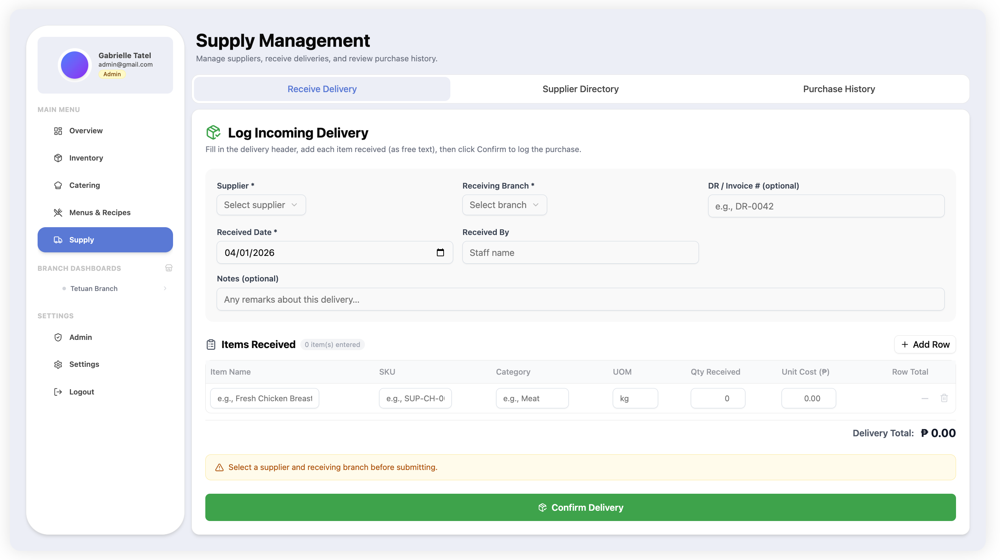
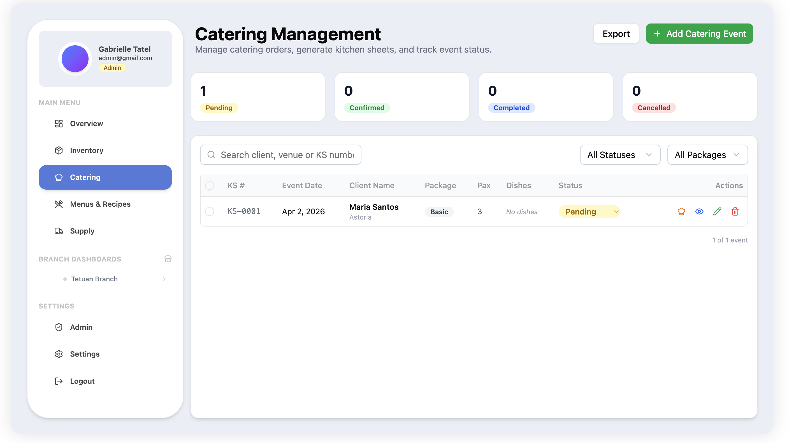

# Multi-Branch Inventory Management System

A full-stack inventory management platform for operating and monitoring stock, supply, menu production, and transfers across multiple business branches.

## Project Overview

This system centralizes branch-level inventory operations into a single web application. It provides a shared source of truth for stock movement, purchasing workflows, menu and recipe cost controls, and operational analytics.

The architecture separates a React frontend and a Django REST backend, with PostgreSQL as the system database.

## Core Functions

- **Multi-branch operations:** Manage branch records and track activity per branch.
- **Inventory control:** Monitor stock records, classify items, and manage quantities.
- **Supply workflow:** Handle procurement-related inventory processes.
- **Menus and recipes:** Structure menu items and recipe-linked inventory usage.
- **Sales and catering support:** Record and view catering/sales-related operational data.
- **Transfer management:** Track item transfers between branches and review transfer history.
- **Role-based access:** Authentication and protected routes for administrative and operational users.
- **Operational dashboarding:** Surface inventory and branch metrics through dashboard views.

## System Modules

### Authentication and Access

- Login and registration flow
- JWT-based session handling
- Protected routes for secured pages
- Admin panel for account oversight

### Inventory and Standards

- Inventory item management
- Inventory category standards
- Unit-of-measurement presets
- Branch-level stock visibility

### Branch and Transfer Management

- Branch setup and maintenance
- Branch-specific dashboard view
- Inter-branch transfer tracking
- Transfer history with searchable records and CSV export

### Production and Operations

- Menus and recipes module
- Supply module
- Catering module

## Page Overview (Documentation)

The following screenshots come from the `documentation/` folder and represent the current UI modules:

### Dashboard


### Menu and Recipes



### Inventory




### Supply




### Catering



## Tech Stack

### Frontend

- React 19
- TypeScript
- Vite
- Tailwind CSS 4
- TanStack React Query
- Axios
- React Router
- Radix UI primitives

### Backend

- Python
- Django
- Django REST Framework
- Simple JWT
- django-filter
- django-cors-headers
- Gunicorn

### Data and Infrastructure

- PostgreSQL 15
- Docker Compose
- pgAdmin (development database administration)

## High-Level Architecture

- **Client (`client/`):** React SPA with route-based modules and API integration.
- **Server (`backend/`):** Django project with domain apps:
  - `accounts`
  - `branches`
  - `inventory`
  - `menusAndRecipes`
  - `supply`
  - `salesAndCatering`
  - `transfer`
  - `bomConsumption`
- **Database:** PostgreSQL service defined in `docker-compose.yml`.

## Local Development

### Prerequisites

- Docker and Docker Compose
- Node.js (for frontend local runs)
- Python (for backend local runs, if not using containers)

### Run with Docker Compose

```bash
docker compose up --build
```

Services:

- Backend: `http://localhost:8000`
- PostgreSQL: `localhost:5432`
- pgAdmin: `http://localhost:5050`

### Frontend (optional local dev flow)

```bash
cd client
npm install
npm run dev
```

Default frontend URL:

- `http://localhost:5173`

## Repository Structure

```text
.
├── backend/          # Django API and domain apps
├── client/           # React frontend
├── documentation/    # UI screenshots used in this README
└── docker-compose.yml
```

## Notes

- This README is intended as a technical overview of the system modules, architecture, and pages.
- For implementation-level details, inspect module code under `backend/apps/` and `client/src/`.